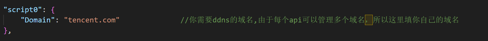
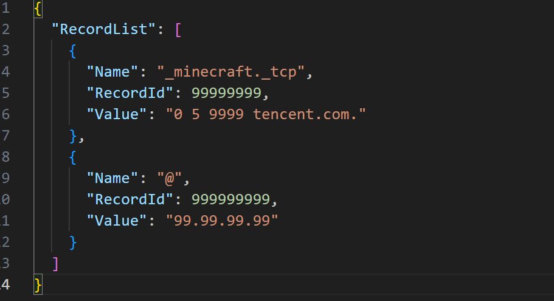
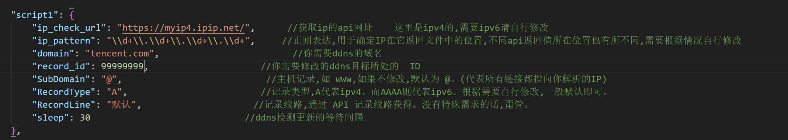
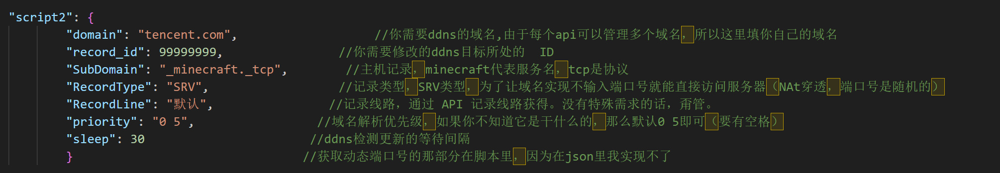

# Natter 
帮助 Natter 实现 SRV 端口及IP全自动DDNS   

可实现让支持SRV的软件，在不输入端口号的情况下就能直接访问对应

具体参考图中的 minecraft

理论上只要能运行Natter的设备都能用（具体自测试）

 - 此分支基于[Natter](https://github.com/MikeWang000000/Natter)，且不支持UDP协议，只支持TCP协议

 - Natter的具体功能及工作原理请自行前往[Natter](https://github.com/MikeWang000000/Natter)查看，这里只讲述如何使用[Natter-TencentCloud-ddns](https://github.com/shapaozidex/Natter-TencentCloud-ddns)

## windows教程
win这边如果不想用打包好的话，直接用linux的就行了（实际上就是python源码）

1.先把整个包下载下来  解压

2.打开[腾讯云 API 密钥](https://console.dnspod.cn/account/token/apikey)创建好api之后将api保存下来：

3.打开腾讯云解析界面，随便创建两个解析，一个SRV类型的，一个A类型的
  这里直接照着我的一模一样的填就行了（防止不会弄而出错，反正后面都要通过ddns改掉）
  
  _minecraft._tcp  |  SRV  |   默认  |  0 5 9999 tencent.com. 
  -----------------|-------|---------|-------------------------
  @                |   A   |   默认  |  99.99.99.99
             

4.然后打开文件夹里的config.json，找到对应选项填进去：
tencent_api

5.填完tencent_api之后，把script0填上

6.填完之后保存，然后打开Get ID文件夹，运行一次Get ID.（目录里就会多出来一个record.json文件）
打开之后看到两个 RecordId 

7.按照图中所示，将对应的id填到对应的位置script1是A类型，script2才是SRV类型。别填错了

script1 

script2

8.全部弄完之后，保存关闭

9.打开DDNS，然后打开natter，直接输入你想穿透的端口号就行了（一般需要先开启需要穿透的软件
然后再启动natter（如果启动的时候报错就说明端口号被占用或者你的那个软件不支持端口复用
如果出现这种情况，那就只能用linux端去解决了

## linux教程

暂无
linux端没有打包，需自行测试。
我没有linux设备，暂时不发教程，但理论上是和win这边一模一样的。只不过你需要手动安装python2.7或者python3和腾讯的
tencentcloud-sdk-python 模块sdk安装指令我会放到对照表里，具体自己去看
