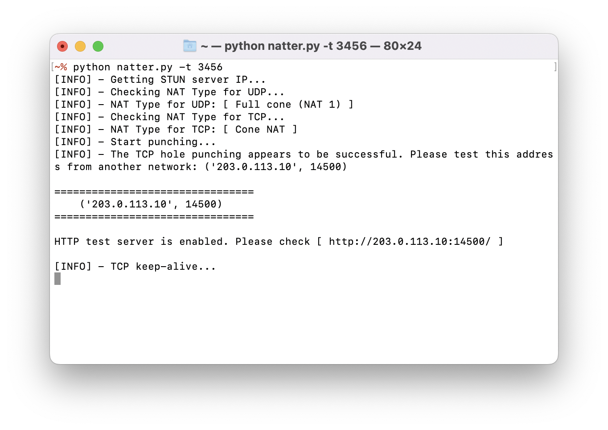
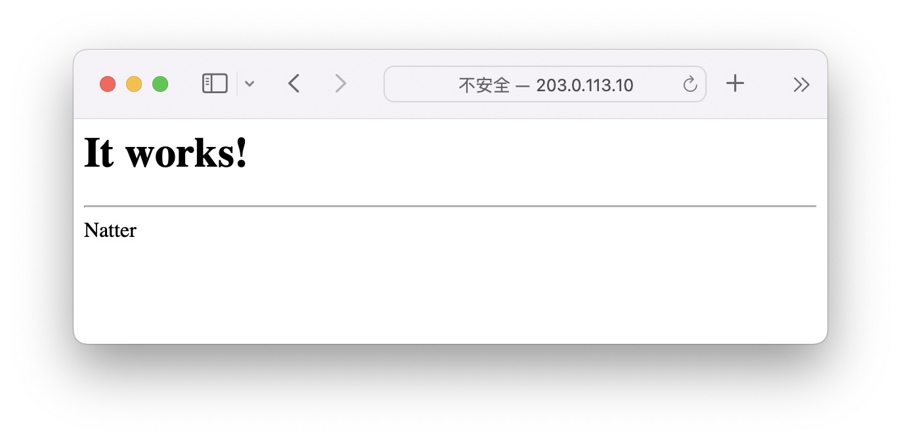
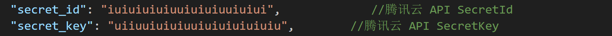

# Natter
帮助 Full cone NAT (NAT 1) 用户打开公网 TCP 端口。  


## 使用例
在本地 3456 号 TCP 端口上实行 TCP 打洞，并开启测试用 HTTP 服务：
```
python natter.py -t 3456
```
成功打洞后：


使用外部网络访问该公网地址 `http://203.0.113.10:14500/`，可见 `It works!` 字样：


打洞测试成功后，可以去掉 `-t` 选项，然后将 3456 端口转发至您想要的目标地址上。

## 转发方法
您可以这样设置端口转发：

在 OpenWRT 网页端中「网络」 - 「防火墙」 - 「端口转发」，填写以下信息：

 协议 | 外部端口 | 内部 IP 地址  | 内部端口
------|----------|---------------|----------
 TCP  | 3456     | 192.168.1.100 | 443

此时，我们在 OpenWRT 上使用 Natter 在 `3456` 号端口进行打洞，即可向外网暴露 `192.168.1.100:443` 。
```
python natter.py 3456
```


## 原理图



## 方案

- **推荐方案：**  
    光猫设置桥接模式，在路由器系统如 OpenWRT 上直接运行 Natter（仅经过一层 NAT）

- **可行方案：**  
    在子网中的主机上运行 Natter，在光猫或路由器上对其开启 DMZ 功能，或对需要开放的端口设置端口转发。（经过多层NAT）


## 大概率会失败的情形
- **不满足基本条件：**  
    经过测试，我的网络不是 NAT 1；

- **多层非可控 NAT：**  
    光猫处于路由模式，我无法关闭光猫的防火墙，并对其设置 DMZ 主机或改桥接；

- **运营商设置了防火墙：**  
    我在外部网络使用 `nmap` 对出口 IP 地址进行 TCP 全端口扫描，发现均为 `filtered` 。


## 错误解读 & 解决方法

```
This OS or Python does not support reusing ports!
```
此操作系统或者 Python 不支持端口重用。  
**解决方法：** 推荐使用内核版本 4.0+ 的 Linux 系统。

```
No public STUN server is avaliable. Please check your Internet connection.
```
没有可用的公共 STUN 服务器。请检查您的网络连接。  
**解决方法：** 检查网络，检查防火墙是否阻止 TCP/UDP 端口 3478。如果是脚本内置列表中的服务器不可用，请提 issue。

```
You cannot perform TCP hole punching in a symmetric NAT network.
```
您无法在一个对称型 NAT 网络中实行 TCP 打洞。  
**解决方法：** 此网络无法打洞。检查您的网络拓扑。检查您是否处于多层 NAT 下。

```
TCP hole punching seems to fail. Maybe you are behind a firewall.
```
TCP 打洞似乎失败了。您可能处于防火墙下。  
**解决方法：** 如果外部网络可以访问 Natter 提供的地址，请忽略此条信息。尝试关闭光猫的防火墙。如果处于多层 NAT 下，请在光猫或路由器下设置 DMZ 主机或者端口转发。如果上述方案不能解决改问题，则是运营商设置了防火墙，此网络无法开放 TCP 端口。
